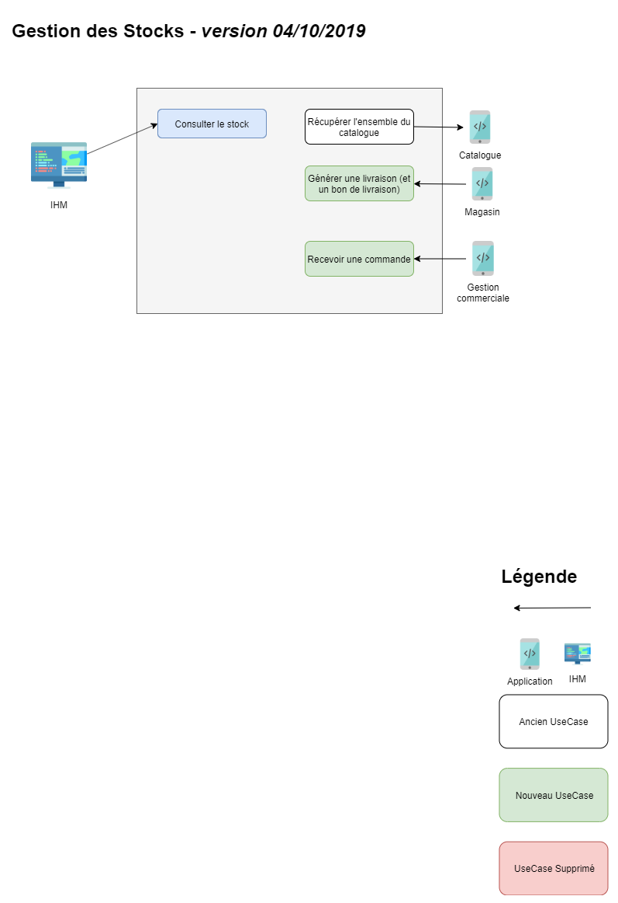

[Sommaire](https://ursi-2020.github.io/Documentation/)

[API](api.md)

# Use Case

# Rôle de l'application

Le rôle de la gestion commerciale est de passer commande auprès des fournisseurs afin de réaprovisionner les stocks. Elle assure aussi la connexion avec le magasin et le e-commerce pour proposer du réassort et la disponibilité des stocks.

# Membres du groupe

* Nicolas Cendrier
* Erwan Chabaud (PO)
* Julien Gantzer
* Alexandre Rodrigues
* Jean-Baptiste Verdret
